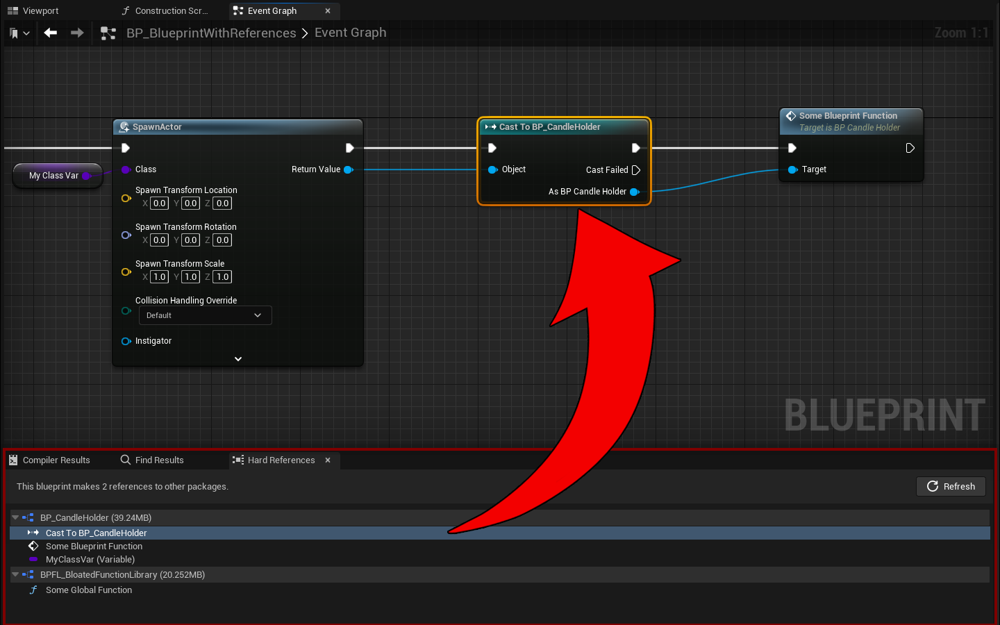
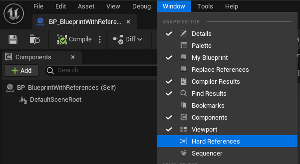

# HardReferenceViewer

An editor-only, Unreal Engine 5 Plugin for finding hard referencing nodes in a blueprint.
Compatible with Unreal Engine 4.27 & 5.1.

# Installation

Download the zip (or clone this repository) to your project plugin folder.

Build the game with the plugin.

If necessary, enable the plugin from the plugins windows.

# Usage

Open any blueprint with a graph or function view.

